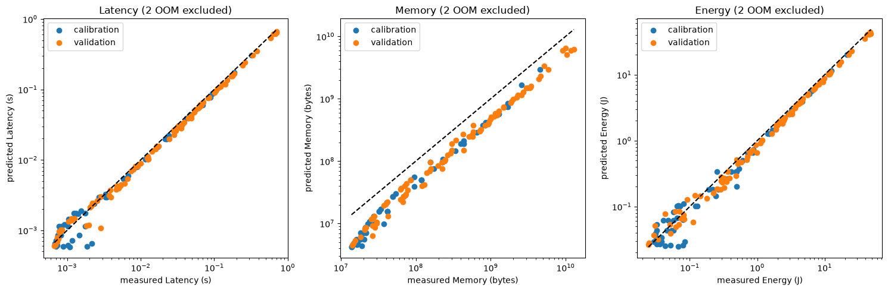
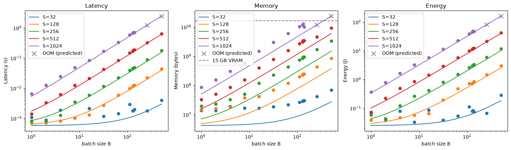
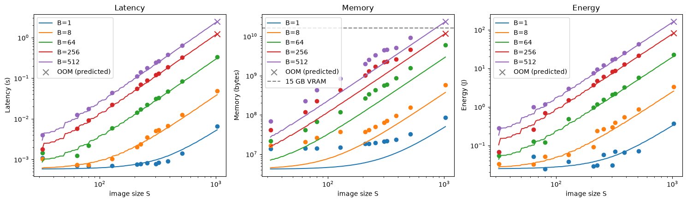

# Самсонов А.А. 

M4152, 368758

# HW1

## Выведение формул на бумаге

Продублирую тут текстом свои предположения:

- MaxPool, ReLU и GlobalAvgPool получают flops = 0. Они наверняка производят не ноль 
  операций, но это не MAC'и. Слои в любом случае быстрее станут memory bound (надо 
  прочитать и записать много, считать - мало).
- Считаю что пиковое потребление памяти = сумма всех весов + пиковый футпринт одного 
  слоя за весь forward pass

## Особенности кода, замеров, среды исполнения

Все эксперименты и замеры я запускал в google colab в среде исполнения T4 на версии 
от 2026-08-06. Закешированные ответы можно найти по ссылке в шапке файла measurements.py. 
Были закреплены random seed (42), все операции выполнялись последовательно. Ниже 
приведена подробная информация о среде

```
gpu: Tesla T4
nvidia_driver: 580.82.07
cuda_runtime: 13.0
cudnn_version: 92600
torch_version: 2.11.0+cu130
python_version: 3.13.15
platform: Linux-6.6.122+-x86_64-with-glibc2.39
```

Замеры памяти производились при помощи `torch.cuda.max_memory_allocated()` с чисткой 
кеша и удалением объекта данных. Замеры времени производились при помощи следующего кода

```python
torch.cuda.synchronize()
start = time.perf_counter()
model(x)
torch.cuda.synchronize()
times.append(time.perf_counter() - start)
```

Я не знаю как еще корректнее это сделать. 
Замер энергии производился с параллельного потока, который запускал запрос 
`nvidia-smi --id=0 --query-gpu=power.draw --format=csv,noheader,nounits` каждые 2 мс

Все результаты для каждого набора параметров S, B замерялись 20 раз (forward - 
проходов) и усреднялись. 

Формулы подсчетов для каждого слоя были вынесены в отдельный модуль utils, в файле 
equations.py содержится только аггрегат. 

Зависимости для запуска `calibrate.py` и `plot_results.py` управляются при помощи uv или pip:
``` 
uv sync
# OR
pip install -r requirements.txt
```

или poetry, возможно тоже поддерживает

## Замеры, анализ, проблемы

Экспортировал данные из колаба и подставил их в скрипт `calibrate.py`. Методом меньших 
квадратов подобрал все параметры, сохранил их в `results/theta.json`. На основе 
полученных параметров симулировал ожидаемые результаты. Ниже - соотношение реальных и 
предсказаных данных.



Как видно на графике, latency и energy довольно близко коррелируют с предсказаными 
данными, однако реальный расход памяти стабильно выше прогнозируемого. с учетом того, 
что формулы для latency и energy корректно откалиброваны, а расходы памяти выше 
ожидаемого, источник расхождения, скорее всего, скрыт в особенностях реализации 
алгоритмов внутри pytorch. 

Ниже представлены графики соотнощения предсказанных (линии) и фактических (точки) 
значений относительно S и B. Так как расходы памяти показали самое аномальное 
поведение, ниже выделю отдельный блок для интерпритации произошедшего. Все остальные 
метрики близко следуют своим предсказаным значениям за исключением некоторого шума 
свойственного реальным системам. 




**Память**

Я не могу быть уверен, почему замеры памяти так отличаются от предсказаных значений. 
Загнал полученные данные в scipy (`linregress(log_predicted, log_measured)`), получил 
log-log ~~ 0.93 (SE=0.007). Следовательно, формы распределений похожи. В среднем все 
измерения были в 2.36 раз больше прогнозируемых. Также можно визуально отметить 
некоторый оверхед. Не знаю что дальше с этим делать. Перепроверил 10 раз, никакого 
обучения не происходит и никакие градиенты не должны сохраняться. Либо pytorch 
каким-то иным способом раскладывает память, либо надо просто поступать как математики 
и без объяснения приписыват к формулам число $e$. 

## launch-bound -> memory-bound -> compute-bound

### launch

Я откалибровал latency относительно производительности видеокарты и ее пропускной 
способности (`flops_rate` и `bandwidth`) и получил значения для системы на которой я 
это запускал. Получилось, что флопсов ~~ 3.86 TFLOPs/s, пропускной способноси памяти 
~~ 84 GiB/s. Следовательно, граница между compute и memory bound (AI) режимам работы 
~~ 43 flops/byte. 

Что-то мало по сравнению с официальной спецификацией для этой карты: общали 8.1 TFLOPs 
и пропускную способность памяти в 300 GB/s. Подозреваю, особенности колаба

Также есть дополнительный параметр t_startap - приблизительное время для инициализации 
любого подсчета на gpu. ~~0.05 мс. К launch bound комбинациям я отнесу все случаи где 
\> 50% latency были связаны с t_startap:

```
S64; B1-32
S80; B1-16
S128;  B1-8
S208;  B1-4
S224;  B1-4
S256;  B1-2
S304,320,384; B1
```

### memory

Для этой сети зона получилась почти пустой (S=32,B=128 и S=64,B=32). Причина 
заключается в архитектуре самой модели. CONV слои арифметически тяжелее линейных 
или иных слоев, соответственно перевес зачастую будет в сторону compute bound. В 
`utils/cnn_ai_example.py` можно прогнать подсчеты на одном небольшом слое и получить 
что он почти всегда compute-bound. 

### compute

Оставшиеся записи, соответственно, стали compute bound. 

### Выводы

Последовательность launch-bound -> memory-bound -> compute-bound получилось выделить, но 
с оговоркой что конфигурация на которой запускались измерения практически моментально 
стала compute bound. Совпадает с особенностями памяти выше, где реальное потребление 
росло быстрее моделированного. 