# Отчет о воспроизведении статьи "Super-Convergence: Very Fast Training of Neural Networks Using Large Learning Rates".

Самсонов Александр Александрович

# Содержание статьи

## Аннотация

Авторы статьи исследуют возможность применения значительно больших LR при обучении
нейронных сетей. В их экспериментах, при увеличении LR (от 0.1 до ~3) наблюдался
феномен который они назвали "супер-сходимость". В статье демонстрируется, как
применение большего LR позволяет обучить модель на порядок быстрее и/или достичь
лучших показателей генерализации.

## Список тезисов

Ниже перечислены все заявления которые делают авторы.

| заявление                                                                                      | где           |
|------------------------------------------------------------------------------------------------|---------------|
| Range test для LR ResNet-56 показывает хорошие результаты вплоть до 3                          | Картинка 2b   |
| Обучение при помощи их 1-cycle сценария показывает лучшие метрики и обучентся в ~8 раз быстрее | Картинка 1    |
| Чем меньше данных, тем больше разница в результатах 1-Cycle vs PC-LR                           | Таблица 1     |
| Чем меньше размер сети, тем больше разница в результатах (...)                                 | Картинка 4    |
| Высокий LR является регуляризатором                                                            | Приложение A2 |
| Увеличение batch size улучшает результаты 1-Cycle обучения                                     | Таблица 7     |
| моменты 0.8-0.9 работают корректно, 0.95 ухудшаются результаты                                 | Таблица 8     |
| При применении 1-Cycle режима, BN является бутылочным горлышком                                | Приложение A5 |
| Без-гессевый оценщик оптималльного LR указывает на применение больших LR                       | Картинка 3    |
| Adam не достигает супер-сходимости, nesterov - достигает                                       | Картинка 9    |
| MNIST обучается за 12 эпох вместо 85 при супер-сходимости, демонстрирует лучший accuracy       | Таблица 2     |

## Ресурсы авторов

Большая часть экспериментов запускалась на кластере из 64 узлов с 8 видеокартами
Nvidia Titan Black, 128 GB RAM и двумя процессорами Intel Xeon E5-2620 v2. Остальные
эксперименты запускались на 32 узлах IBM Power8 с 20 ядрами, 4 видеокартами
Tesla P100 и 255 GB памяти на узел.

# Условия воспроизведения

## Техническое оснащение

Все вычисления проводились на 1 карте Nvidia T4 с 15 GB vRAM в бесплатной среде google
colab. Все вычисления были разбиты на 3 сессии в разные дни, для восстановления
состояния использовались чекпоинты и контроль random seed. Общее время вычислений - ~~
4 часа.

## Предварительные наблюдения и находки

При подготовке к экспериментам были обнаружены следующие факты

### 1-Cycle на малом количестве итераций

1-Cycle описан в статье использующий следующий алгоритм:

- поиск min и max LR при помощи range test
- Линейный рост LR от min до max 45% итераций
- Линейное убывание LR от max до min 45% итераций
- Линейное убывание до $\frac{min}{100}$ 10% итераций

При экспериментом с меньшим бюджетом (кол-вом итераций) обнаружилось, что рост LR
более чем на ~~1e-3 на первых ~100 итерациях приводили к схлопыванию сети к
константным предсказаниям. Для избежания этого я добавил сглаживание при помощи
функции $\frac{x^{2}}{x^{2}+\left(1-x\right)^{2}}$. Первые 200 итерация рост
происходит исходя из ее значений, так как она площе и первые 100 итераций растут со
скоростью ~4e-3. После этого изменения сети перестали схлопываться на первых итерациях.

### Применение amp vs fp

Так как я ограничен в вычислительных мощностях, я использовал режим amp, а оценки
проводил в режиме fp32. Это сократило время большинства экспериментов в ~~3 раза по
сравнению с плной точностью. Этого хватало для проверки гипотез и воспроизведения
"формы" эксперимента.

### data loader проблемы

При подготовке стало понятно, что 2 vCPU среды colab не хватает для того чтобы
поддерживать скорость работы. Датасеты и модели вполне влезали в vRAM, потому они
хранились целиком на GPU. Результат:

**До**

```
ResNet-20: 0.035 s/it model only, 0.263 s/it with loader
ResNet-56: 0.096 s/it model only, 0.278 s/it with loader
ResNet-110: 0.195 s/it model only, 0.319 s/it with loader
```

**После**

``` 
ResNet-20: 0.038 s/it model only, 0.039 s/it with loader
ResNet-56: 0.105 s/it model only, 0.107 s/it with loader
ResNet-110: 0.200 s/it model only, 0.200 s/it with loader
```

Еще плюс к скорости работы.

## Постановка и результаты экспериментов

Для проверки основных положений статьи я выбрал проверить следующий заявления 1, 2, 9
и 11. Я посчитал, что они максимально отражают суть самой работы и демонстрируют
главные находки. Ниже описаны постановки и результаты 4 экспериментов, нацеленных на
проверки этих заявлений.

### Эксперимент 1: range test на большем диапазоне

В статье авторы демонстрируют, их экперименты демонстрируют корректное поведение
модели во время LR range test даже при значениях на порядок больше стандартных.

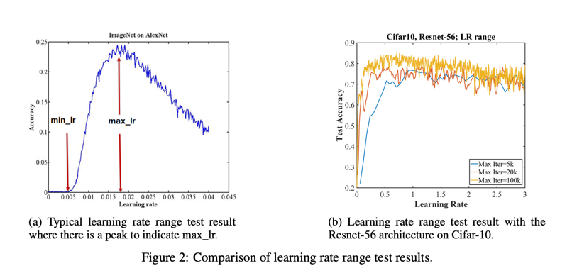

Как и указано выше, LR нельзя наращивать слишком быстро. Левый край графика демонстрирует
процесс обучения модели, а не непосредственный эффект заданного LR. Однако тенденции
возможно сравнить. Далее представлен график range теста (3 проверки на разных seed).

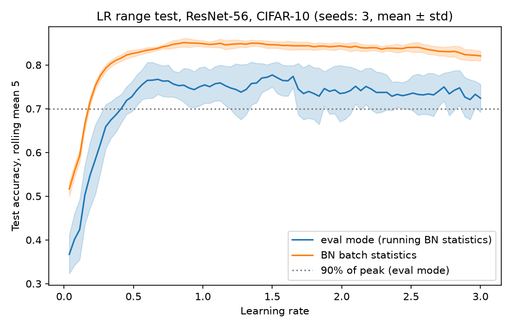

Как можно видеть, наблюдения авторов продублированы. Хоть точность и выходит на плато,
но модель не демонстрирует никакие аномалии при росте LR далеко за пределы стандартных
0.1.

### Эксперимент 2: применение без-гессевого оценщика для LR

В главе 4 авторы статьи демонстрируют свое уравнение для оценки оптимального LR без
подсчета полной матрицы Гессе:

$$
\epsilon^*=\epsilon\frac{\theta_{i+1}-\theta_i}{2\theta_{i+1}-\theta_i-\theta_{i+2}}
$$

Где $\theta_i$ - веса модели на i'й итерации, $\epsilon$ - фактический LR,
$\epsilon^*$ - прогнозируемый оптимальный LR.

Авторы предоставляют следующие графики, которые указывают что оптимальный LR долгое
время остается значительно выше используемого, находится в диапазоне 2-6 при обучении
в режиме 1-Cycle, при постоянном LR ~~0.2.

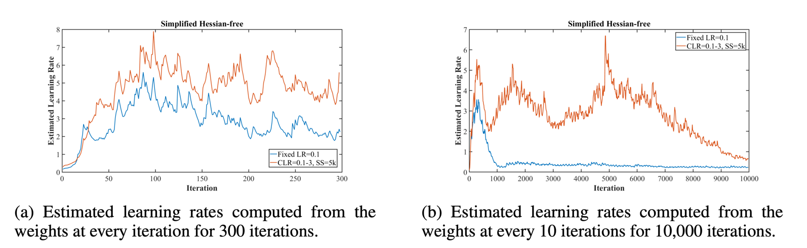

Я запустил аналогичный эксперимент и получил следующие результаты:

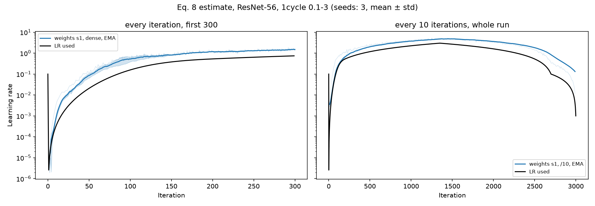
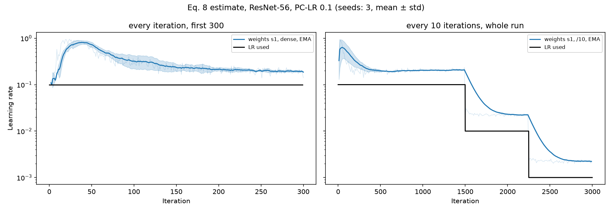

Также прикладываю те же графики, но с линейным y

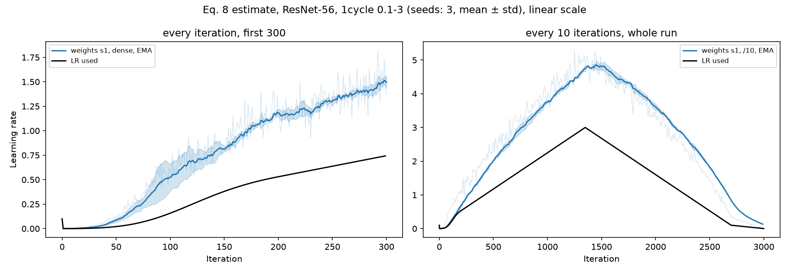
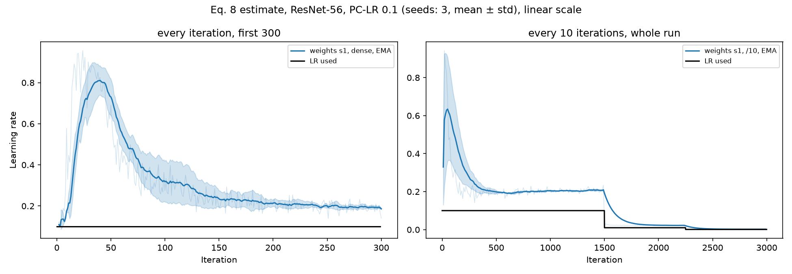

Заметно, как предсказанный LR близко следует за фактическим, демонстрируя результат ~~
эквивалентный 2x LR. Для проверки я попробовал изменить стратегию и семплировать
фактические градиенты на каждом шаге и сравнить результаты предсказанные этим оценщиком.

dense - семплирование подряд  
/10 - семплирование каждые 10 итераций  
weights - семплирование весов модели  
grads - семплирование градиентов модели  
s - stride, шаг между точками тройки θ_k, θ_k+s, θ_k+2s

Как видно, в большинстве случаев не получается воспроизвести цифры из статьи
(оптимальные LR в разы больше фактического). Елинственное отклонение от стандартной
картины происходит при семплировании градиентов с шагом s=10, где мы получили цифры схожие
на статью.

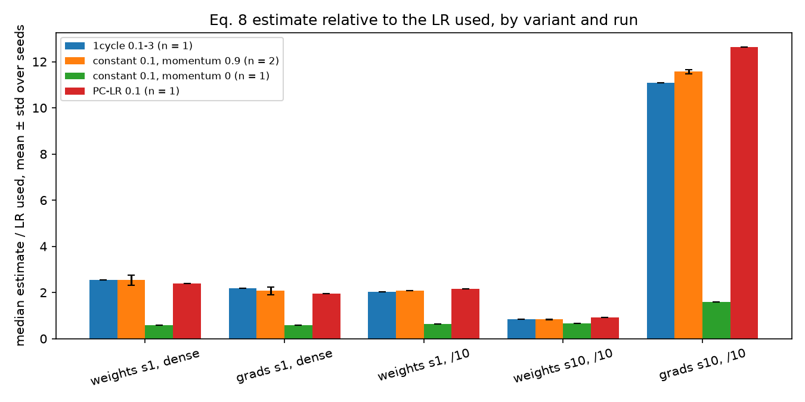

Я препдолагаю следующие причины, по которым этот эксперимент не продемонстрировал
схожих результатов:

- Данная формула оценки оптимального LR на самом деле высчитывает что-то иное
  (в тч потому что фактический LR применяется в вычислениях)
- На результат сильно влияет momentum: при расчёте через 10 итераций с momentum 0.9
  оценка в ~11.6 раз выше фактического LR. Похоже, цифры 2–6 из статьи отражают
  накопленный за несколько шагов сдвиг весов, а не прогнозирует 

В связи с сильным расхождением моих результатов и результатов авторов, считаю этот 
пункт не воспроизведенным. 

### Эксперимент 3: сравение скорости обучения модели lenet на mnist

В статье был приведен пример супер-сходимости, где сеть lenet достигла
супер-сходимости и достигла больших результатов accuracy в ~7 раз быстрее.

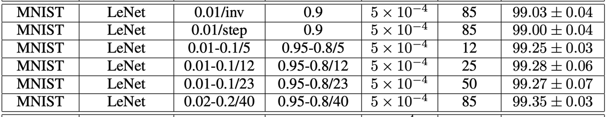

Я воспроизвел результаты этого эксперимента. Сравнил результаты, которые у меня
получилось достичь при 1-Cycle режиме обучения, статичный LR при том же кол-ве
итераций. Получившиейся результаты приведены на графиках:

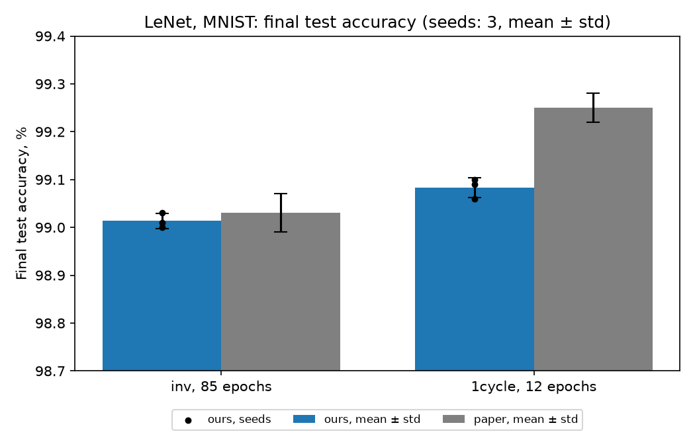

В сравнении со статьей наблюдался меньший прирост точности, однако формы данных впосле
совпадают. Можно сделать вывод, что больший LR приводит к более быстрой сходимости.

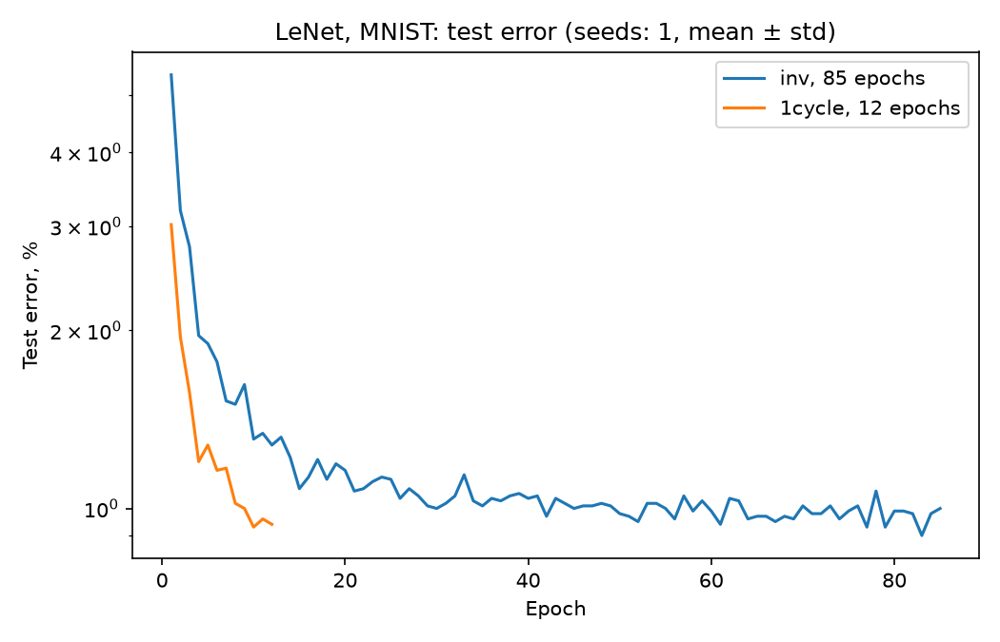
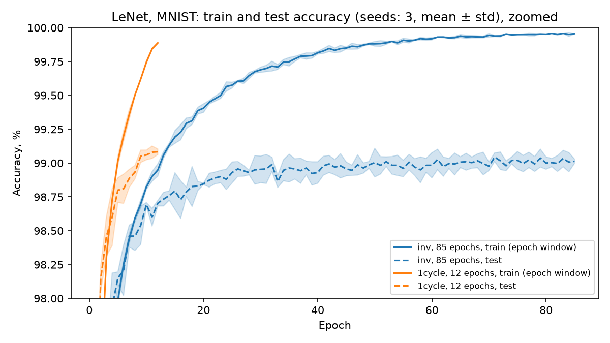

Полученные результаты при супер-сходимости действительно превзошли традиционный метод
обучения и показали большую генерализацию.

### Эксперимент 4: сравнение результатов обучения 1 cycle vs PC-LR

Филальный эксперимент масштабирует находки с MNIST н комбинацию ResNet-56 + CIFAR 10.
В статье авторы демонстрируют проявление супер-сходимости, где модель обучается в 8
раз быстрее и показывает лучшие метрики. Также в этих данных демонстрируется, что
разница между классическим и 1-Cycle режимами обучения растет при уменьшении
количества данных.

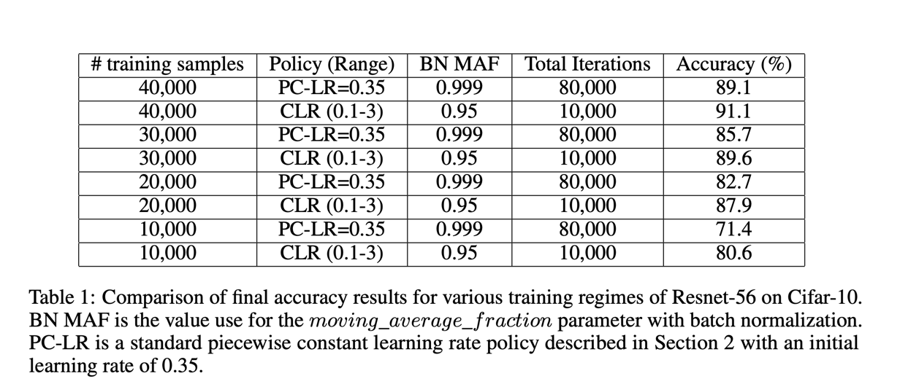

В связи с ограничением вычислительных мощностей я решил проверить лишь первую часть
этого заявления. Это несколько дублирует находки предыдущего эксперимента, но зато
закрепляет достоверность феномена супер-сходимости, если его возможно наблюдать в
больших моделях. Стоит отметить, что тестирование супер-сходимости происходило на 3000
итераций, что в 3 раза меньше замеров авторов (10_000).

Во всех запусках производились следующие 3 замера:

- 1-Cycle режим
- PC-LR с тем же количеством итераций
- PC-LR с 8x количеством итераций

Ниже продемонстрирована динамика LR в данных экспериментах.

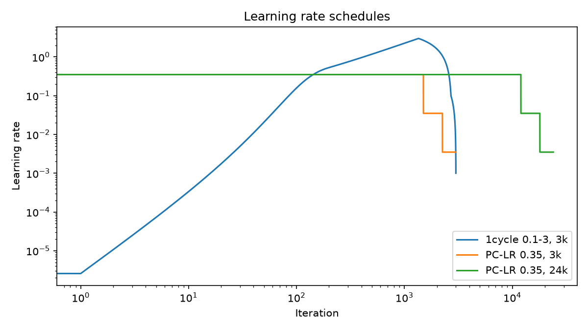

Далее предлагаю рассмотреть динамику train loss для этих режимов:

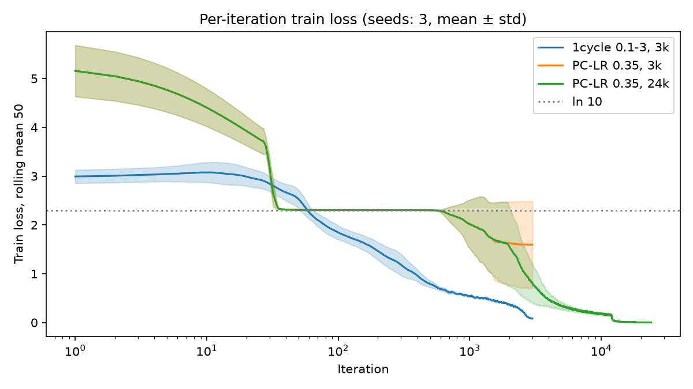

Стоит заметить, как PC-LR "застрял" при обучении, предсказывая константное значение.
Также можно отметить, режим как 1-Cycle опять продемонстрировал способность превзойти
стандартный режим обучения. Соответствующий график test accuracy повторяет картину,
которую мы наблюдали при экспериментах с mnist.

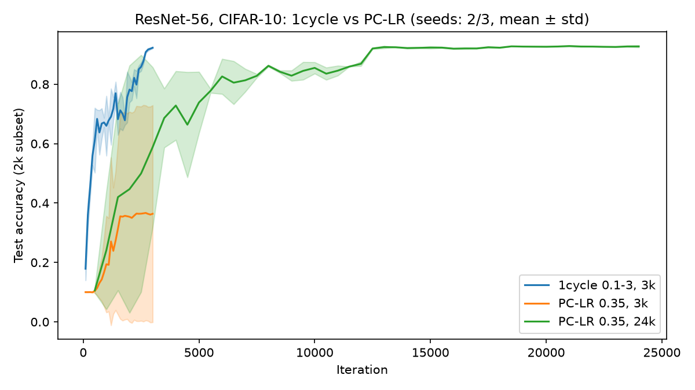

## Проблемы с эксприментами

Шум на замерах. При больших LR test accuracy может меняться на ~5 пп между итерациями

Схлопывание в эксперименте 4. Без warm-up, оба запуска PC-LR предсказывали один
класс долгое время

Оценщик LR. Формула по шагам весов даёт ~~2x фактического LR при любом режиме обучени
(проверено на 3 seed). Значения 2–6 из статьи получаются только у оценки по градиентам с
шагом 10 итераций при momentum 0.9

MNIST ниже статьи. 1-Cycle дал 99.08% - меньше, чем в статье (99.25%)

Отличия постановки. Batch size 512 вместо 1000, бюджет 3k/24k вместо 10k/80k, MAF 0.95

# Выводы

| Тезис                         | Воспроизведение                                                  | Итог                                                                                      |
|-------------------------------|------------------------------------------------------------------|-------------------------------------------------------------------------------------------|
| range test до LR 3            | плато вплоть до LR 3, без схлопывания (3 seed)                   | воспроизведён                                                                             |
| 1-Cycle в 8x быстрее и точнее | 91.96% за 3k против 91.86% за 24k; PC-LR за 3k - 78.04% (? seed) | частично: не хуже при 8× меньшем бюджете // жду кредитов колаба, возможно и воспроизведен |
| оценка оптимального LR 2–6    | по шагам весов 2x фактического LR                                | не воспроизведён в исходной форме, требуются дополнительные изыскания                     |
| MNIST за 12 эпох вместо 85    | 99.08 против 99.01 (3 seed)                                      | воспроизведён, абсолютная точность ниже (batch size меньше, было ожидаемо)                |

Супер-сходимость воспроизводится на втрое меньшем бюджете. 1-Cycle с LR до 3 обучает
ResNet-56 за 3000 итераций до той же точности, что PC-LR за 24000, а LeNet за 12 эпох
обгоняет стабильный LR за 85.

Без-гессевая оценка из главы 4 в основном повторяет фактический LR, умноженный на
константу. Этот аспект требует дальнейших разбирательств
